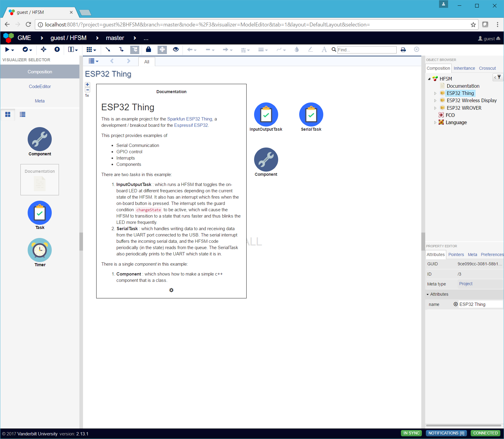
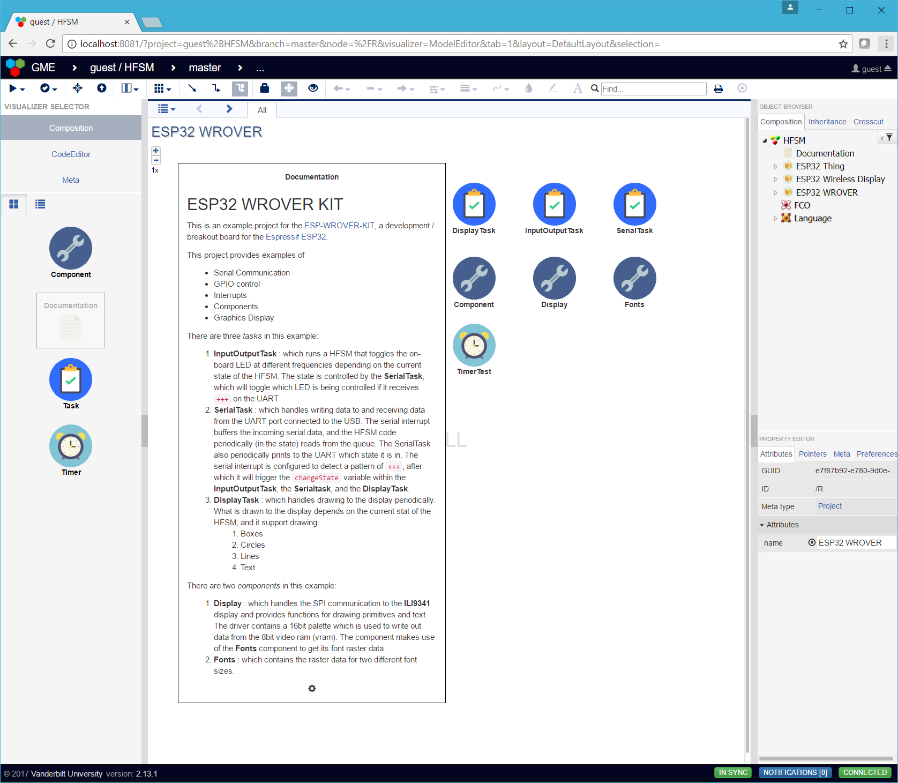
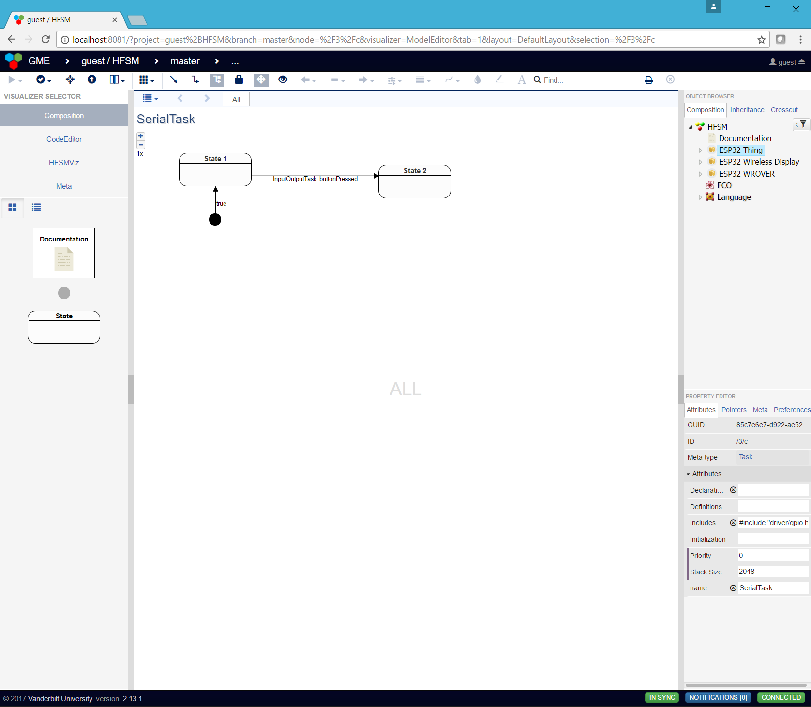
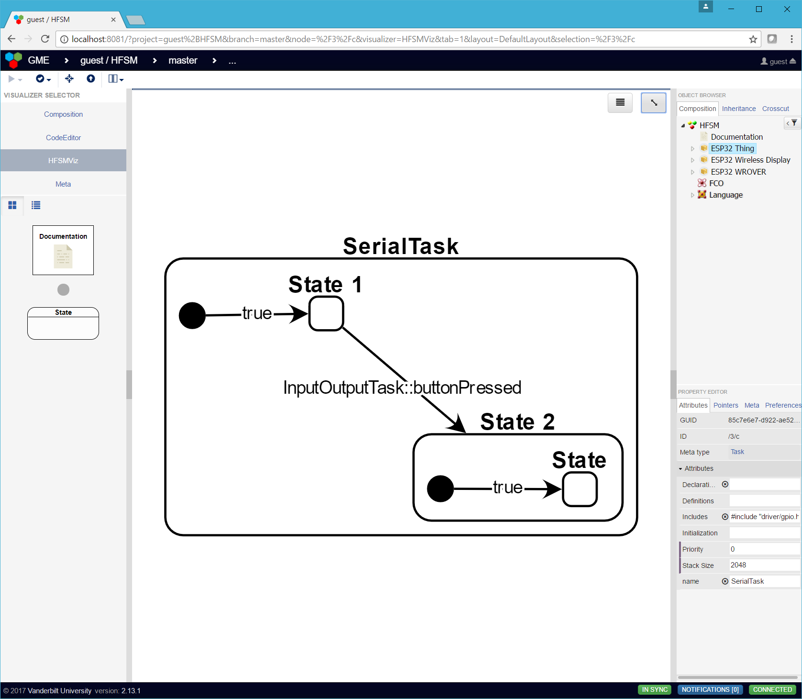
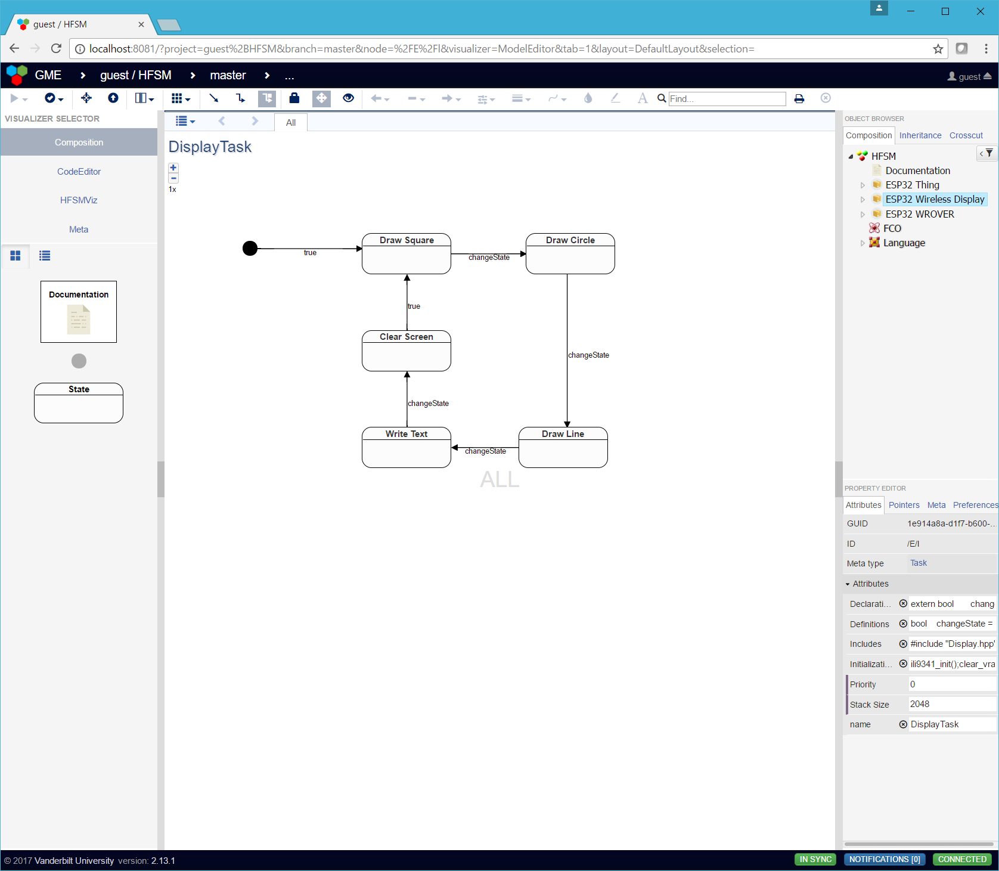
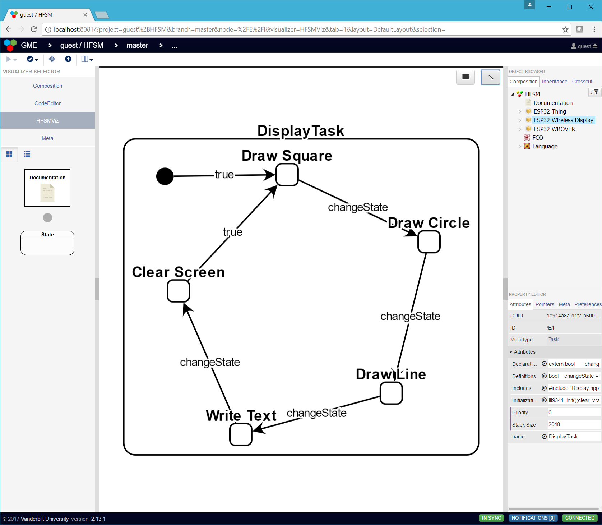

# WebGME HFSM

WebGME App for creating Executable Heirarchical Finite State Machines
(HFSMs)

This repository contains the plugins and base seed for creating HFSMs
with embedded c/c++ code in each state (for `initialization`, the
state's periodic `state function`, and the `exiting` the state).  The
WebGME app utilizes the
[CodeEditor](https://github.com/finger563/webgme-codeeditor) to allow
users to edit the code for the model as if it were part of an IDE.

## Hierarchical Finite State Machine (HFSM) Description
 
HFSMs are trees, where a state may have zero or more substates, and
where states in the same level of the same subtree can transition
between each other according to certain *guard conditions*. The *guard
conditions* for all possible transitions out of the current state are
checked every time the state function executes. In this HFSM, the
state function executes as a periodic function either within a task or
a timer in [FreeRTOS](http://freertos.org) according to the
periodicity set by the state. Note that only leaf-states have valid
timer periods.
 
The guard conditions check state variables that can either be set in
the execution of state functions or be set in the execution of an
interrupt.

In these HFSMs, projects can contain any number of:

* Tasks
* Timers
* Components

Example Projects (included in the
[Base Seed](./src/seeds/base.webgmex)):

### Tasks

Tasks are HFSMs which get generated into a single task with a dynamic
period based on the currently active **leaf state**. Since tasks are
[FreeRTOS Tasks](http://www.freertos.org/a00019.html), they can
contain blocking code (e.g. *vTaskDelay*).

Tasks have the following attributes:

* `Includes` : include statements referencing other tasks or 
  components, will be at the top of the generated header
* `Initialization` : intialization code run at the beginning of the task.
* `Declarations` : variable/function/class declarations within the 
  task's namespace, will be within the generated header
* `Definitions` : variable/function/class definitions within the 
  task's namespace, will be within the generated source file

### Timers

Timers are HFSMs which get generated into a single timer with a
dynamic period based on the currently active **leaf state**. Since
timers are
[FreeRTOS Timers](http://www.freertos.org/FreeRTOS-Software-Timer-API-Functions.html),
they **cannot contain blocking code** (e.g. *vTaskDelay*).

Tasks have the following attributes:

* `Includes` : include statements referencing other tasks or 
  components, will be at the top of the generated header
* `Initialization` : intialization code run at the beginning of the task.
* `Declarations` : variable/function/class declarations within the 
  task's namespace, will be within the generated header
* `Definitions` : variable/function/class definitions within the 
  task's namespace, will be within the generated source file

#### Components

Components are libraries for which the `Declarations` (`.h / .hpp`),
and the `Definitions` (`.c / .cpp`) are provided in the model itself.
Whether these are generated as `c` or `c++` libraries depends on the
setting of the component's **Language** attribute.

## HFSMViz

The **HFSMViz** visualizer allows the visualization of a HFSM (such as
that for a `Task` or a `Timer`) at a single location, instead of
having to navigate through the model and only being able to see a
small neighborhood of nodes at single time, which may be good for
clearing context when developing the model but hinders understanding
of the model as a whole.

Simple Serial State Model:

And the HFSM Visualized:

Display State Model:

And the HFSM Visualized:

## Code Generation

The **SoftwareGenerator** plugin supports generation of a `Project`
and it's `Components`, `Timers`, and `Tasks` into code for the ESP32,
including the eclipse project configuration.

You can edit the code attributes for the `Timers`, `Tasks`, `States`,
and `Transitions`, within the CodeEditor visualizer.
