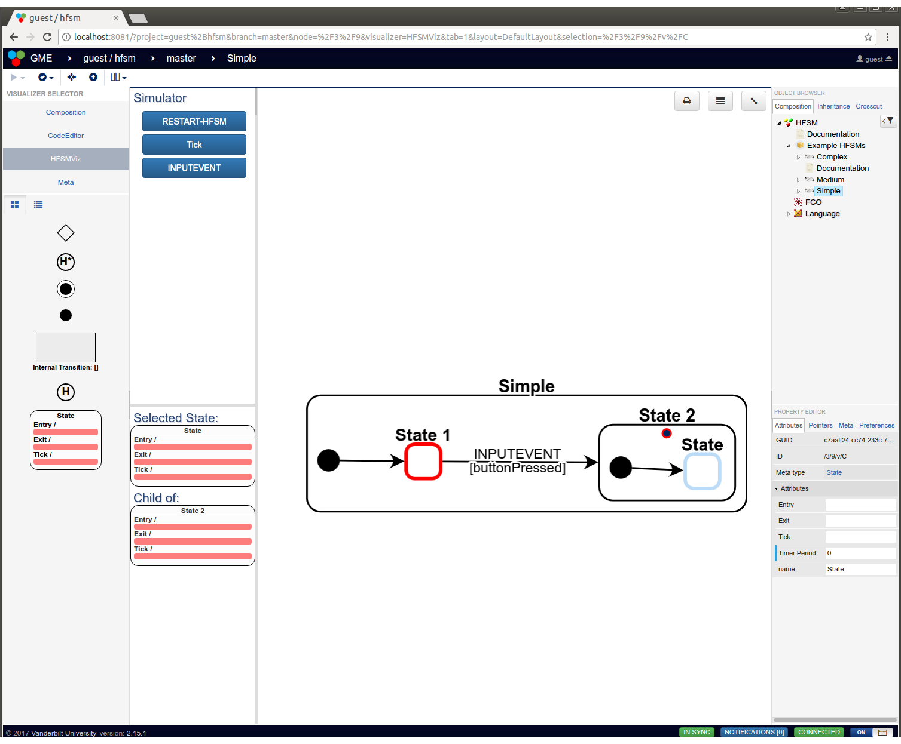
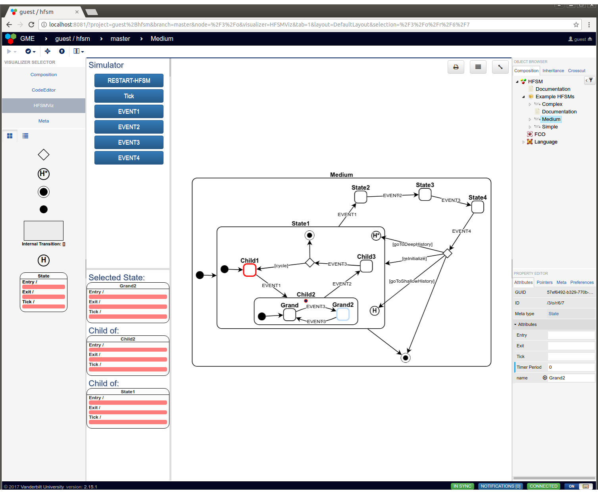
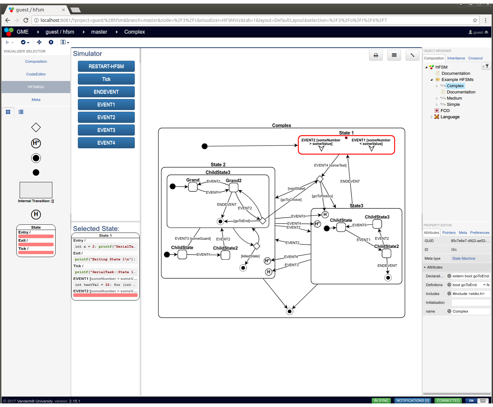

# WebGME HFSM

WebGME App for creating Executable Heirarchical Finite State Machines
(HFSMs). Contains metamodel, visualization, simulation, and code
generation for Heirarchical Finite State Machines (HFSMs) following
the UML State Machine specification.

## Features

* Complete modeling of State Machines following the UML specification
  including:
  * States
  * Events
  * Internal Transitions
  * External Transitions
  * Choice Pseudostates
  * Deep History Pseudostates
  * Shallow History Pseudostates
  * Initial States
  * End States
* Interactive model creation
* In-model **interactive simulation** of the HFSM
* In-model code attribute editing for the HFSM
* Model transformation plugin to produce executable **C++** code from
  the HFSM (*with more languages coming soon*!)

## Description

This repository contains the plugins, decorators, and visualizers (all
of which are WebGME Components) and the base and example seeds for
creating HFSMs with embedded c/c++ code in each state. The WebGME app
utilizes the [CodeEditor](https://github.com/finger563/webgme-codeeditor) to allow users to edit the code for the
model as if it were part of an IDE.

Together these components and (meta-)modeling environment make up the
*State Machine Domain* for WebGME.

## Hierarchical Finite State Machine (HFSM) Description
 
HFSMs are trees, where a state may have zero or more substates.
 
In this modeling paradigm, `Projects` can contain any number of `State
Machines`.

Example HFSMs included in the [UML State Diagrams Seed](./src/seeds/UMLStateDiagrams.webgmex):

The [Base seed](./src/seeds/base.webgmex) contains just the `Meta` definitions for the
projects and HFSMs following the UML State Diagram specification.

### State Machines

State Machines have the following attributes:

* `Includes` : include statements for the HFSM, will be at the top of
  the generated header
* `Initialization` : intialization code run at the beginning of the
  HFSM, before any of the state initialization code.
* `Declarations` : variable/function/class declarations within the
  HFSM's `StateMachine` namespace, will be within the generated header
  file
* `Definitions` : variable/function/class definitions within the
  HFSM's `StateMachine` namespace, will be within the generated source
  file

## HFSMViz State Diagram Visualizer and Simulator

The **HFSMViz** visualizer allows the visualization of the full
HFSM. It also provides:
* An interface to see which events will be handled by the HFSM when it
  is in a selected (or active) state
* *Simulation* of the HFSM which properly traverses the transitions from
  the currently active state to the next active state when the user
  spawns an event into the simulation.
  * The visualization will even pop up dialogs asking the user which
    guard condition should be evalutated to true when the HFSM passes
    through a choice pseudostate or when multiple transitions have the
    same event trigger and different guards.
* Drag and drop external transition creation between two nodes of the
  HFSM
* *Automatic layout* and routing of the edges and nodes of the HFSM
  tree
* *Context menu* allowing the user to: 
  * Toggle the display of a state's children
  * Set the active
  * Add a new element (which can also be done by dragging from the
    `Part Browser` and dropping onto the visualizer.

## Code Generation

The **SoftwareGenerator** plugin supports generation of a `Project`
and it's `State Machines` into executable code, with the option of
generating test-bench code for interactively testing out the generated
HFSM and tracing through which actions occur in what order when an
event is spawned.

You can edit the code attributes for the `State Machines`, `States`,
`Internal Transitions`, and `External Transitions` within the
CodeEditor visualizer.

### Test Bench Code

When the test code is generated, it generates a `Makefile` which
builds a `test` and `DEBUG` target for each of the `State Machines` in
the `Project` from which the plugin was executed. These test bench
codes compile in (using a preprocessor define `DEBUG_OUTPUT`) logging
code which traces when transitions are fired, which guards are true,
which actions are executed, and which events are in the State
Machine's event queue.
